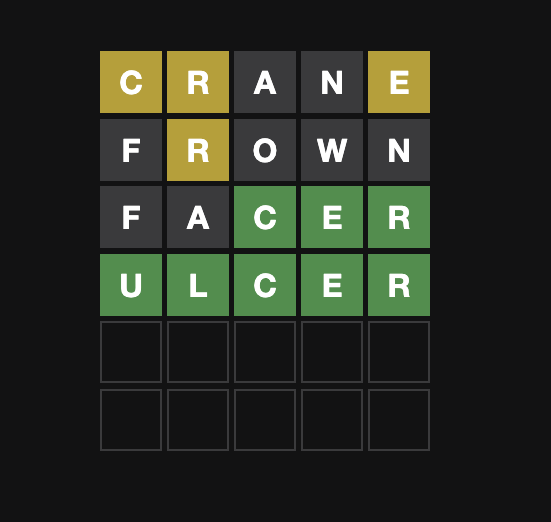
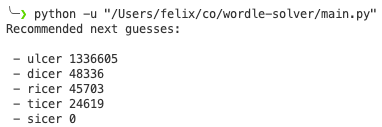

# Wordle solver
A python script to solve Wordle puzzles.

https://www.nytimes.com/games/wordle/index.html

## How to use
- Git clone this repo to your machine
- Open the main.py file in your favorite text editor
- Find the section `wordle_raw` and adapt it to your current board state
- Run and pick one of the 10 recommended words based on frequency
- Repeat until solved!

## How to enter your wordle board:
The wordle solver uses a text based representation of the board to compute the best *next* guesses using english language frequency as a heuristic (as the puzzle designers are more likely to pick well known than obscure words).

In the program input, each capital letter refers to the actual letter (A-Z) while each lower case letter refers to its color:

-  `b` for "black"
-  `y` for "yellow"
-  `g` for "green"

Say you had the following current wordle state:



This would be represented as:

```python
wordle_raw = [
    "Cy Ry Ab Nb Ey",
    "Fb Ry Ob Wb Nb",
    "Fb Ab Cg Eg Rg",
]
```

When you run the program, it would then give you a list of recommended next guess with an integer indicating their frequency in the English language:



## Data sources
- words_alpha.txt: https://github.com/dwyl/english-words
- unigram_freq.csv: https://www.kaggle.com/rtatman/english-word-frequency
